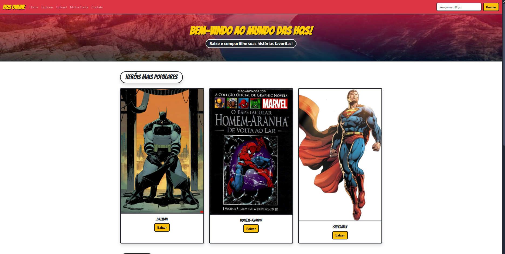
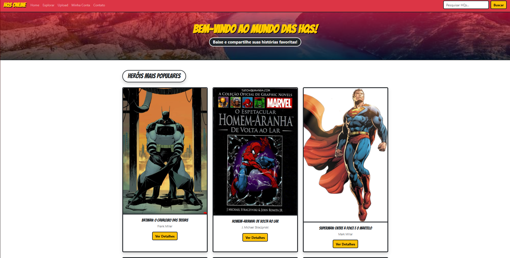

# Trabalho Prático 05 - Semanas 7 e 8

**Páginas de detalhes dinâmicas**

Nessa etapa, vamos evoluir o trabalho anterior, acrescentando a página de detalhes, conforme o  projeto escolhido. Imagine que a página principal (home-page) mostre um visão dos vários itens que existem no seu site. Ao clicar em um item, você é direcionado pra a página de detalhes. A página de detalhe vai mostrar todas as informações sobre o item do seu projeto. seja esse item uma notícia, filme, receita, lugar turístico ou evento.

Leia o enunciado completo no Canvas. 

**IMPORTANTE:** Assim como informado anteriormente, capriche na etapa pois você vai precisar dessa parte para as próximas semanas. 

**IMPORTANTE:** Você deve trabalhar e alterar apenas arquivos dentro da pasta **`public`,** mantendo os arquivos **`index.html`**, **`styles.css`** e **`app.js`** com estes nomes, conforme enunciado. Deixe todos os demais arquivos e pastas desse repositório inalterados. **PRESTE MUITA ATENÇÃO NISSO.**

## Informações Gerais

- Nome:Gabriel Henrique Fernandes Vieira
- Matricula:878933
- Proposta de projeto escolhida:
O projeto tem como objetivo desenvolver um site voltado para fãs de histórias em quadrinhos (HQs), oferecendo uma plataforma onde os usuários possam visualizar, fazer download e compartilhar HQs de diferentes gêneros e heróis populares, como Batman, Homem-Aranha, Superman, entre outros
- Breve descrição sobre seu projeto:

## Print da Home-Page



## Print da página de detalhes do item



## Cole aqui abaixo a estrutura JSON utilizada no app.js

```javascript
const dados = [
  {
    "id": 1,
    "titulo": "Batman: O Cavaleiro das Trevas",
    "categoria": "Heróis",
    "autor": "Frank Miller",
    "data": "1986-06-10",
    "imagem": "https://i.pinimg.com/736x/b6/3b/ac/b63bac84c98dad1f6ed129674548fb24.jpg",
    "conteudo": "Em Gotham, o vigilante Batman retorna após anos de aposentadoria para enfrentar o crime e seus antigos inimigos. Uma HQ sombria e aclamada que redefiniu o herói."
  },
  {
    "id": 2,
    "titulo": "Homem-Aranha: De Volta ao Lar",
    "categoria": "Heróis",
    "autor": "J. Michael Straczynski",
    "data": "2001-07-15",
    "imagem": "http://static.hq-now.com/hqs/hqs/uploads/picture/image/253125/De_Volta_ao_Lar_-_001.jpg",
    "conteudo": "Peter Parker tenta equilibrar sua vida como estudante e super-herói, enfrentando novos desafios em Nova York e redescobrindo sua identidade como o Amigão da Vizinhança."
  },
  {
    "id": 3,
    "titulo": "Superman: Entre a Foice e o Martelo",
    "categoria": "Heróis",
    "autor": "Mark Millar",
    "data": "2003-04-01",
    "imagem": "https://upload.wikimedia.org/wikipedia/en/3/35/Supermanflying.png",
    "conteudo": "Nesta história alternativa, a nave de Superman cai na União Soviética em vez dos EUA. O resultado é um herói moldado pela ideologia comunista."
  },
  {
    "id": 4,
    "titulo": "Mulher-Maravilha: Renascimento",
    "categoria": "Heróis",
    "autor": "Greg Rucka",
    "data": "2016-09-21",
    "imagem": "https://hqrock.files.wordpress.com/2014/07/wonder-woman-36-cover-2014-by-david-finch.jpg",
    "conteudo": "Diana de Themyscira redescobre suas origens enquanto enfrenta antigas e novas ameaças, reafirmando seu papel como símbolo de força e compaixão."
  },
  {
    "id": 5,
    "titulo": "Homem de Ferro: Extremis",
    "categoria": "Heróis",
    "autor": "Warren Ellis",
    "data": "2005-01-01",
    "imagem": "https://hqrock.files.wordpress.com/2012/08/iron-man-1-cover-2012.jpg",
    "conteudo": "Tony Stark precisa enfrentar uma nova biotecnologia perigosa enquanto questiona o futuro da humanidade e das armas de destruição em massa."
  },
  {
    "id": 6,
    "titulo": "Invencível: Volume 1",
    "categoria": "Heróis",
    "autor": "Robert Kirkman",
    "data": "2003-01-22",
    "imagem": "https://i.pinimg.com/736x/5a/53/3c/5a533cfca69098347bb4b9d08edfd25f.jpg",
    "conteudo": "Mark Grayson descobre seus poderes e tenta seguir os passos de seu pai, o herói Omni-Man, enquanto enfrenta verdades sombrias sobre sua família."
  }
];